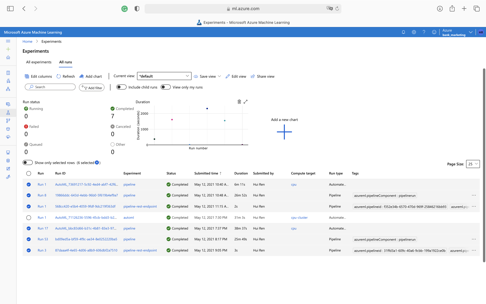
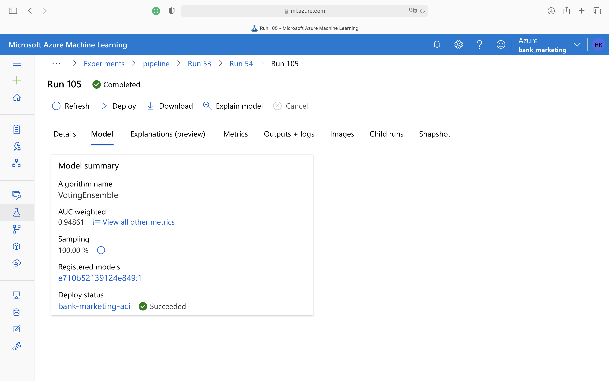
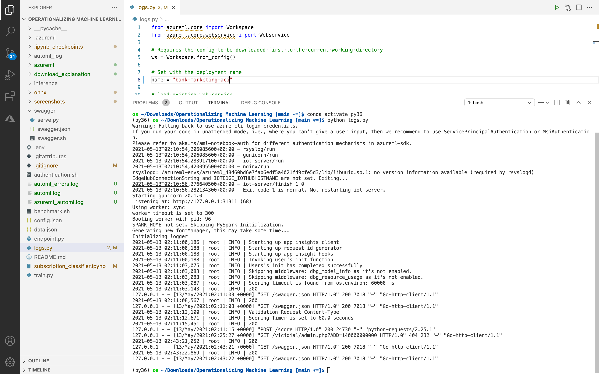
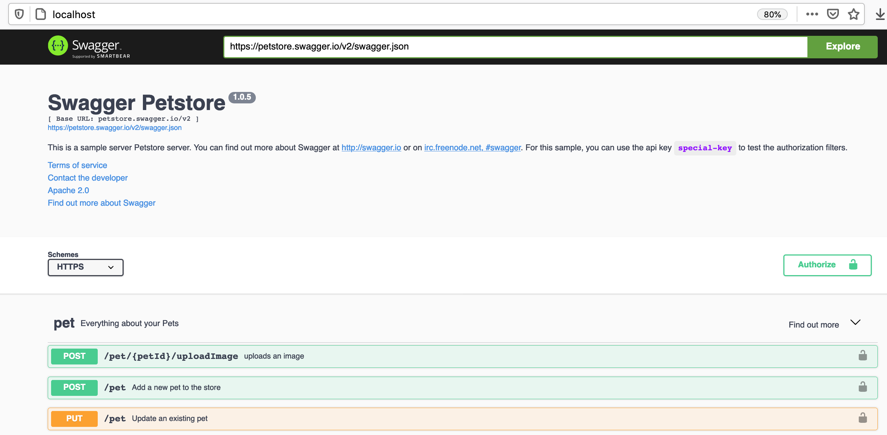
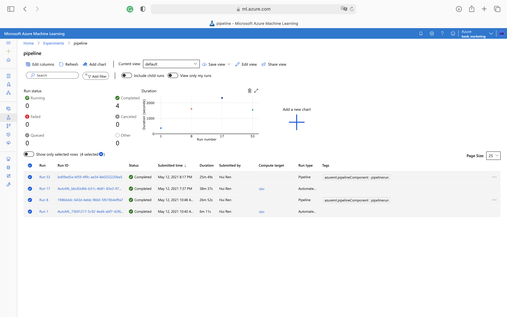
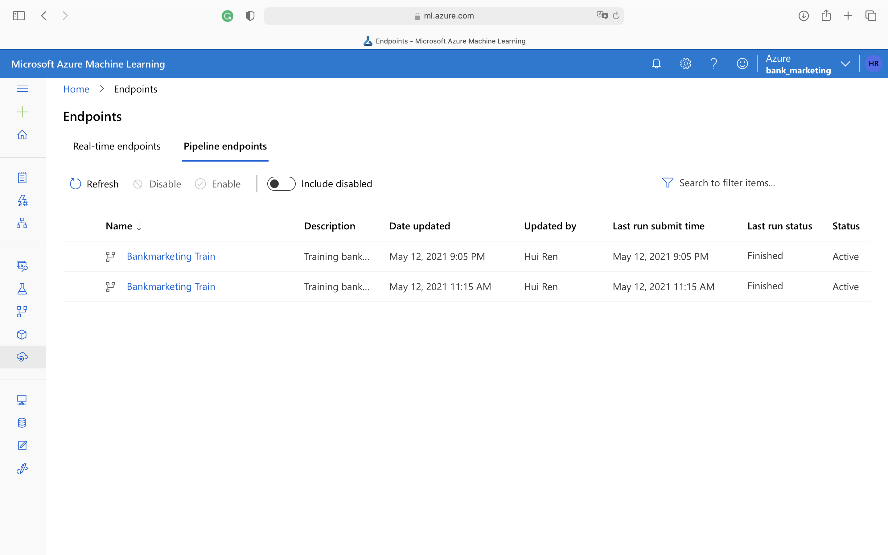

# Operationalizing Machine Learning
Shipping models into production in a reliable, reproducible, and automated way with a constant feedback loop is crucial. This is where all the DevOps and MLOPs principles come into play. In this project, I leveraged Azure AutoML to build classifiers that predict whether the client will subscribe to a term deposit with the bank, and deployed the best model to an Azure Container Instance (ACI). I applied key concepts of operationalizing Machine Learning, from enabling Application Insights and identifying problems in logs, to harnessing the power of Azure Pipelines and automating the process.  

## Architectural Diagram

## Key Steps
1. **Authentication**

    Modify `authentication.sh` to update the values of a few variables, including the resource group name and the workspace name. Create a Service Principal account and associate it with the workspace by running `bash authentication.sh`.
    
    
2. **Automated ML Experiment**

    Execute the `Setup`, `Data` and `Train` steps in `subscription_classifier.ipynb`. Go to Azure portal to see the graphical representations. 
    
    
3. **Deploy the Best Model**
    Execute the `Deploy`, and `Test` steps in `subscription_classifier.ipynb`.
    After the experiment run completes, a summary of all the models and their metrics are shown, including explanations. The Best Model will be shown in the Details tab. In the Models tab, it will come up first (at the top). Make sure you select the best model for deployment. 
    
4. **Enable Application Insights**

    Run `python logs.py`.
    
    
5. **Swagger Documentation**

    Download `swagger.json` from Azure `Endpoints` section and put it in the `swagger` folder. Run `bash swagger.sh` and `python serve.py`. 
    
    `swagger.sh` will download the latest Swagger container, and it will run it on port 80. If you don't have permissions for port 80 on your computer, update the script to a higher number (above 9000 is a good idea).

    `serve.py` will start a Python server on port 8000. This script needs to be right next to the downloaded swagger.json file. This will not work if swagger.json is not on the same directory.

    Open the browser and go to http://localhost:8000 where serve.py should list the contents of the directory. swagger.json must show. If it doesn't, it needs to be downloaded from the deployed model endpoint.
    
    Go to http://localhost/ which should have Swagger running from the container (as defined in swagger.sh). If you changed the port number, use that new port number to reach the local Swagger service (for example, http://localhost:9000 if port 9000 is used).
    
    On the top bar, where petsore.swagger.io shows, change it to http://localhost:8000/swagger.json, then hit the Explore button. It should now display the contents of the API for the model. 
    
    Look around at the different HTTP requests that are supported for your model, including the example.
    
6. **Consume Model Endpoints**

    Modify `uri` and `key` values in the `endpoint.py` file, the values can be found in the AzureML Endpoints Section. Run `python endpoint.py` to generate predictions using the deployed model.
    
    Modify `URI` and `KEY` in the `benchmark.sh` and run `bash benchmark.sh` to call apache benchmark.
    
    

7. **Create, Publish and Consume a Pipeline**
    
    
    
    
    
    
    
## Screen Recording
Here is the [link](https://youtu.be/NMyYJ88iy-Y) to the recording.

## Future Improvements
- Implement data lineage tracking
- Implement a CI/CD pipeline that automatically updates the deployed model with updated data
- Implement a testing suite